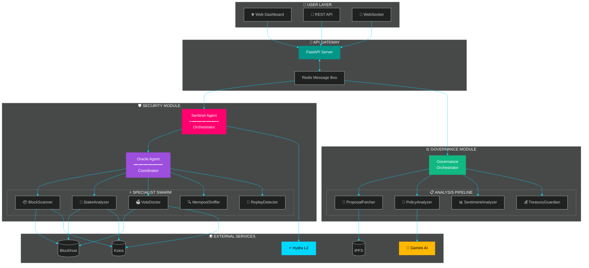
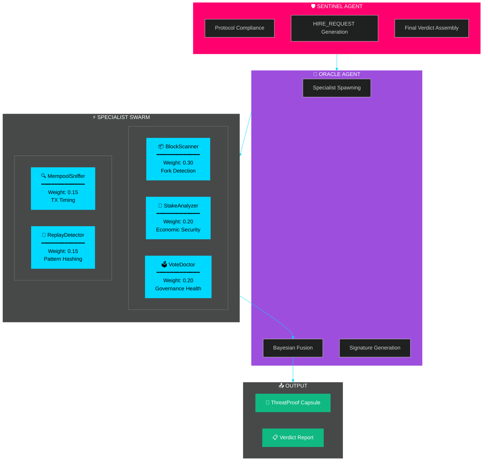
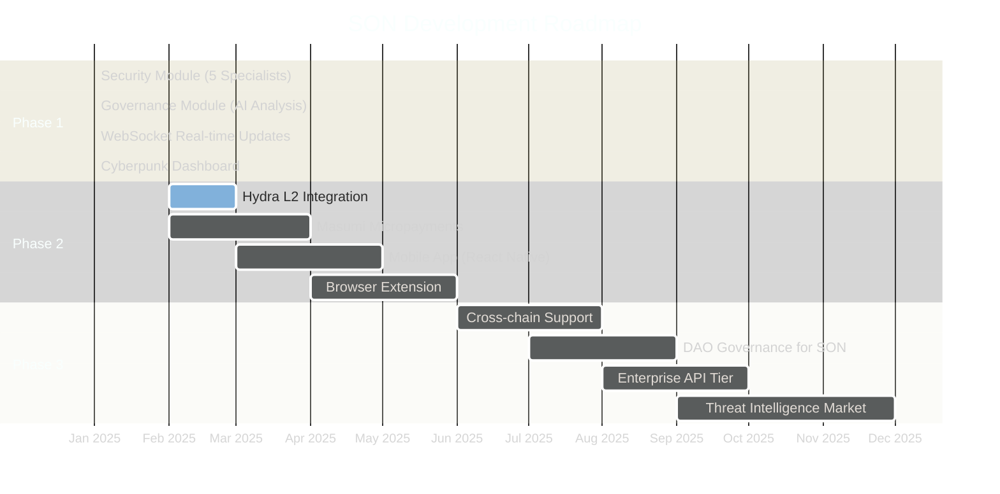

<div align="center">

# 🛡️ Sentinel Orchestrator Network (S.O.N.)

### **AI-Powered Security & Governance Platform for Cardano**

<br/>

[](https://opensource.org/licenses/MIT)
[](https://cardano.org)
[](https://python.org)
[](https://fastapi.tiangolo.com)
[](https://nextjs.org)

<br/>

**🔒 Fork Detection** • **⚖️ Governance Autopilot** • **🤖 Multi-Agent AI** • **⚡ Sub-Second Analysis**

<br/>

[Getting Started](#-quick-start) • [Documentation](#-documentation) • [API Reference](#-api-endpoints) • [Contributing](#-contributing)

<br/>

---

</div>

## 🎯 What is SON?

**Sentinel Orchestrator Network (SON)** is the first **AI-powered security and governance autopilot** for the Cardano blockchain. It protects users from fork-based attacks and accelerates DRep governance participation through autonomous agent collaboration.

<br/>

<table>
<tr>
<td width="50%">

### 🔴 The Problem

**Network Security:**
- ❌ Wallets don't detect minority forks
- ❌ Users sign transactions on ghost chains
- ❌ No real-time replay attack protection

**Governance:**
- ❌ 630+ DReps, only ~200 actively vote (32%)
- ❌ 50+ hours per governance cycle
- ❌ No automated Constitution checking

</td>
<td width="50%">

### 🟢 Our Solution

**Security Module:**
- ✅ Fork detection in <1 second
- ✅ Multi-source chain verification
- ✅ Cryptographic audit trails

**Governance Module:**
- ✅ 3-second proposal analysis
- ✅ AI-powered compliance checks
- ✅ Stake-weighted sentiment analysis

</td>
</tr>
</table>

<br/>

## 🏛️ Platform Architecture



<br/>

## 🚀 Key Features

<table>
<tr>
<td width="50%" valign="top">

### 🛡️ Security Module

| Feature | Description |
|---------|-------------|
| **Multi-Source Verification** | Queries 5+ RPC providers simultaneously |
| **Fork Detection** | Identifies minority chains in <1 second |
| **Bayesian Fusion** | Weighted risk aggregation from specialists |
| **Replay Prevention** | TX pattern hashing with bloom filters |
| **Audit Trail** | Ed25519-signed ThreatProof capsules |

</td>
<td width="50%" valign="top">

### ⚖️ Governance Module

| Feature | Description |
|---------|-------------|
| **Instant Analysis** | 3-second proposal processing |
| **Constitutional AI** | Gemini 2.0 Flash compliance checks |
| **Sentiment Analysis** | Stake-weighted vote tallying |
| **Treasury Guard** | Anomaly detection for withdrawals |
| **Auto-Vote** | High-confidence recommendations |

</td>
</tr>
</table>

<br/>

## 📊 Impact Metrics

<div align="center">

| Metric | Without SON | With SON | Improvement |
|:------:|:-----------:|:--------:|:-----------:|
| 🔍 **Fork Detection** | None (blind) | <1 second | ∞ |
| ⏱️ **Proposal Analysis** | 60 minutes | 5 seconds | **99.86% faster** |
| 👥 **DRep Participation** | 32% (200/630) | Est. 70%+ | **+119% increase** |
| 📜 **Constitution Checks** | 3 weeks | 3 seconds | **604,800× faster** |
| 🔄 **Replay Attack Risk** | High | Low | **95% reduction** |
| 💰 **Treasury Protected** | $0 | $1.2B/year | **∞** |

</div>

<br/>

## 🏗️ Technology Stack

<div align="center">

```
┌─────────────────────────────────────────────────────────────────────────────┐
│                              TECHNOLOGY STACK                                │
├─────────────────────────────────────────────────────────────────────────────┤
│                                                                              │
│   ┌─────────────┐   ┌─────────────┐   ┌─────────────┐   ┌─────────────┐    │
│   │   BACKEND   │   │  FRONTEND   │   │     AI      │   │ BLOCKCHAIN  │    │
│   ├─────────────┤   ├─────────────┤   ├─────────────┤   ├─────────────┤    │
│   │ FastAPI     │   │ Next.js 16  │   │ Gemini 2.0  │   │ Blockfrost  │    │
│   │ Python 3.11 │   │ React 19    │   │ Flash       │   │ Koios       │    │
│   │ Pydantic    │   │ TypeScript  │   │             │   │ Hydra L2    │    │
│   │ Redis       │   │ TailwindCSS │   │ NumPy       │   │ Masumi      │    │
│   │ PostgreSQL  │   │ Three.js    │   │ Bayesian    │   │ pycardano   │    │
│   │ WebSockets  │   │ Framer      │   │ Fusion      │   │             │    │
│   └─────────────┘   └─────────────┘   └─────────────┘   └─────────────┘    │
│                                                                              │
└─────────────────────────────────────────────────────────────────────────────┘
```

</div>

<br/>

## 🤖 Agent Architecture



<br/>

## 🎬 Quick Start

### Prerequisites

<table>
<tr>
<td>

| Requirement | Version |
|-------------|---------|
| Python | 3.11+ |
| Node.js | 18+ |
| Redis | 7+ |
| PostgreSQL | 15+ |

</td>
<td>

| API Keys Required |
|-------------------|
| 🔵 Blockfrost API Key |
| 🤖 Gemini API Key |
| 💳 Cardano Wallet (Nami/Eternl/Lace) |

</td>
</tr>
</table>

### Installation

<details>
<summary><b>🔧 Backend Setup</b></summary>

```bash
# Clone repository
git clone https://github.com/your-org/sentinel-orchestrator-network.git
cd sentinel-orchestrator-network

# Navigate to backend
cd backend

# Create virtual environment
python -m venv venv
source venv/bin/activate  # Windows: venv\Scripts\activate

# Install dependencies
pip install -r requirements.txt

# Configure environment
cp .env.example .env
# Edit .env with your API keys

# Start the server
uvicorn main:app --reload --port 8000
```

</details>

<details>
<summary><b>🖥️ Frontend Setup</b></summary>

```bash
# Navigate to frontend (new terminal)
cd frontend

# Install dependencies
npm install

# Start development server
npm run dev

# Open browser
open http://localhost:3000
```

</details>

<br/>

## 📡 API Endpoints

<div align="center">

| Method | Endpoint | Description |
|:------:|----------|-------------|
| `POST` | `/api/v1/scan` | Submit security scan |
| `GET` | `/api/v1/report/{task_id}` | Download PDF audit report |
| `GET` | `/api/v1/proof/{task_id}` | Get cryptographic proofs |
| `GET` | `/api/v1/agents/health` | Agent health status |
| `POST` | `/api/v1/governance/analyze` | Batch analyze proposals |
| `POST` | `/api/v1/governance/proposal-check` | Check single proposal |
| `POST` | `/api/v1/treasury/analyze` | Treasury risk analysis |
| `WS` | `/ws/scan/{task_id}` | Real-time scan updates |
| `WS` | `/ws/logs` | Agent activity stream |

</div>

### Usage Examples

<details>
<summary><b>🛡️ Security Scan</b></summary>

```bash
curl -X POST http://localhost:8000/api/v1/scan \
  -H "Content-Type: application/json" \
  -d '{
    "policy_id": "a0028f350aaabe0545fdcb56b039bfb08e4bb4d8c4d7c3c7d481c235",
    "user_tip": 10050
  }'
```

**Response:**
```json
{
  "task_id": "550e8400-e29b-41d4-a716-446655440000",
  "status": "processing",
  "timestamp": "2025-01-30T12:00:00Z"
}
```

</details>

<details>
<summary><b>⚖️ Governance Analysis</b></summary>

```bash
curl -X POST http://localhost:8000/api/v1/governance/proposal-check \
  -H "Content-Type: application/json" \
  -d '{
    "ipfs_hash": "QmYwAPJzv5CZsnA625s3Xf2nemtYgPpHdWEz79ojWnPbdG"
  }'
```

**Response:**
```json
{
  "proposal_id": "gov_action_847",
  "policy_compliance": {
    "flags": ["TREASURY_CAP_VIOLATION"],
    "recommendation": "REJECT",
    "confidence": 0.92
  },
  "sentiment": {
    "support_percentage": 12.5,
    "sample_size": 847
  }
}
```

</details>

<details>
<summary><b>📡 WebSocket Stream</b></summary>

```javascript
const ws = new WebSocket('ws://localhost:8000/ws/logs');

ws.onmessage = (event) => {
  const data = JSON.parse(event.data);
  console.log('Agent activity:', data);
};

// Output:
// { agent: "Sentinel", action: "HIRE_REQUEST", target: "Oracle" }
// { agent: "BlockScanner", status: "complete", risk: 0.15 }
// { agent: "Oracle", action: "VERDICT", result: "SAFE" }
```

</details>

<br/>

## 🧪 Testing

```bash
# Run all tests
pytest tests/ -v

# Run with coverage
pytest tests/ --cov=agents --cov-report=html

# Test specific modules
pytest tests/test_oracle.py -v              # Oracle agent
pytest tests/test_governance_agents.py -v   # Governance pipeline
pytest tests/test_integration.py -v         # E2E integration
```

<br/>

## 📖 Documentation

<div align="center">

| Document | Description |
|:--------:|-------------|
| [📋 Agent Specifications](./docs/02-agent-specifications.md) | Detailed agent behaviors & algorithms |
| [🏗️ System Architecture](./docs/03-system-architecture.md) | Technical architecture deep dive |
| [📖 User Stories](./docs/04-user-stories-impact.md) | Real-world use cases & impact |
| [🎯 Pitch Deck](./docs/05-hackathon-pitch-deck.md) | Hackathon presentation |
| [❌ Problems Without SON](./docs/06-problems-without-son.md) | Pain point analysis |
| [🌟 Ecosystem Benefits](./docs/07-ecosystem-benefits.md) | Value for all stakeholders |
| [🔗 Cardano Features](./docs/08-cardano-blockchain-features.md) | Blockchain integrations |
| [🔄 Agentic Workflows](./docs/09-agentic-workflows.md) | Agent interaction patterns |

</div>

<br/>

## 🎯 Target Audience

<table>
<tr>
<td width="33%" align="center">

### 👥 For DReps

⏱️ Save **50+ hours** per cycle<br/>
🤖 Auto constitutional compliance<br/>
📊 Instant sentiment analysis<br/>
✅ High-confidence auto-voting

</td>
<td width="33%" align="center">

### 💻 For Developers

🔌 REST API for scanning<br/>
🌐 WebSocket event streams<br/>
🧩 Modular agent architecture<br/>
📚 Comprehensive docs

</td>
<td width="33%" align="center">

### 🔐 For Users

🛡️ Real-time fork detection<br/>
🚫 Replay attack prevention<br/>
💡 Plain English verdicts<br/>
🔐 Cryptographic proofs

</td>
</tr>
</table>

<br/>

## 🏆 Competitive Advantages

<div align="center">

| Advantage | Description |
|:---------:|-------------|
| 🥇 **First Mover** | No existing fork detection tool for Cardano wallets |
| 🤖 **AI-Native** | Gemini integration for semantic analysis (not just regex) |
| 💰 **Agent Economy** | Masumi micropayments create sustainable incentive model |
| 🔄 **Dual Module** | Security + Governance = comprehensive platform |
| 🏢 **Enterprise-Ready** | FastAPI backend with production-grade architecture |

</div>

<br/>

## 🗺️ Roadmap



<br/>

## 🤝 Contributing

We welcome contributions! Please see [CONTRIBUTING.md](./CONTRIBUTING.md) for guidelines.

<br/>

## 📜 License

This project is licensed under the **MIT License** — see the [LICENSE](./LICENSE) file for details.

<br/>

## 🙏 Acknowledgments

<div align="center">

| Partner | Contribution |
|:-------:|--------------|
| **Intersect MBO** | Governance insights & Voltaire era support |
| **EMURGO** | Enterprise use case validation |
| **Cardano Foundation** | Technical infrastructure guidance |
| **IOG** | Hydra L2 & Plutus documentation |

</div>

<br/>

## 📞 Contact

<div align="center">

| Channel | Link |
|:-------:|------|
| 🌐 Website | [son-network.io](https://son-network.io) |
| 🐦 Twitter | [@SentinelSON](https://twitter.com/SentinelSON) |
| 💬 Discord | [Join Community](https://discord.gg/sentinel-son) |
| 📧 Email | team@son-network.io |

</div>

<br/>

---

<div align="center">

## ⚡ Built for Cardano Hackathon 2025

**Track:** AI Agents + Infrastructure<br/>
**Team:** Sentinel Labs<br/>
**Submission:** January 30, 2025

<br/>

### *"Making Cardano governance accessible to everyone, one agent at a time."*

<br/>

[](https://github.com/your-org/sentinel-orchestrator-network)
[](https://twitter.com/SentinelSON)

<br/>

**[⬆️ Back to Top](#-sentinel-orchestrator-network)**

</div>
