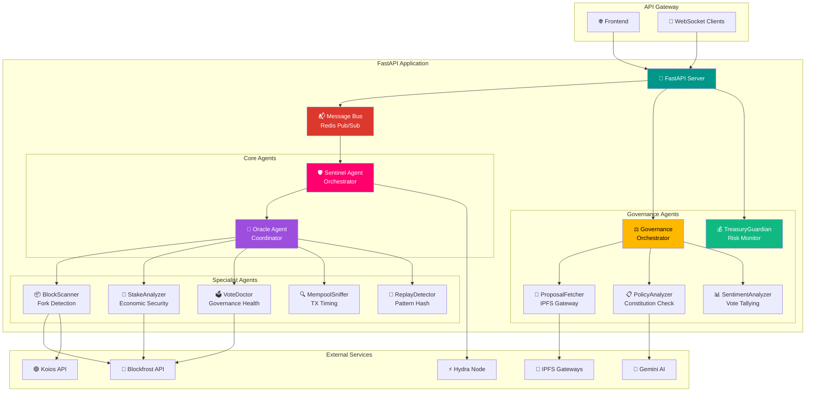

<div align="center">

# ⚙️ SON Backend


**Multi-Agent Security & Governance API for Cardano**

[API Docs](#-api-reference) • [Architecture](#-architecture) • [Quick Start](#-quick-start) • [Agents](#-agent-system)

</div>

---

## 🎯 Overview

The SON Backend is a **high-performance, multi-agent API** built with FastAPI. It orchestrates autonomous agents for:

- 🛡️ **Security Scanning** — Fork detection, replay attack prevention
- ⚖️ **Governance Analysis** — Proposal compliance, sentiment analysis  
- 💰 **Treasury Monitoring** — Risk assessment, anomaly detection
- 🔗 **Hydra L2 Integration** — Sub-second transaction verification

---

## 🏗️ Architecture



---

## 📁 Project Structure

```
backend/
├── 📄 main.py                       # FastAPI application entry point
├── 📄 message_bus.py                # Redis Pub/Sub message broker
├── 📄 requirements.txt              # Python dependencies
├── 📄 .env.example                  # Environment variables template
│
├── 📂 agents/                       # Agent implementations
│   ├── 📄 __init__.py               # Agent exports
│   ├── 📄 base.py                   # BaseAgent abstract class
│   ├── 📄 sentinel.py               # 🛡️ Sentinel (Orchestrator)
│   ├── 📄 oracle.py                 # 🔮 Oracle (Coordinator)
│   ├── 📄 llm_config.py             # Gemini AI configuration
│   ├── 📄 hydra_client.py           # Hydra WebSocket client
│   ├── 📄 hydra_node.py             # Hydra node integration
│   ├── 📄 drep_helper.py            # DRep utility functions
│   ├── 📄 treasury_guardian.py      # 💰 Treasury risk monitor
│   │
│   ├── 📂 specialists/              # Specialist agent swarm
│   │   ├── 📄 __init__.py
│   │   ├── 📄 block_scanner.py      # 📦 Fork detection
│   │   ├── 📄 stake_analyzer.py     # 💎 Economic security
│   │   ├── 📄 vote_doctor.py        # 🗳️ Governance health
│   │   ├── 📄 mempool_sniffer.py    # 🔍 TX timing analysis
│   │   ├── 📄 replay_detector.py    # 🔄 Replay prevention
│   │   └── 📄 specialist_service.py # Microservice wrapper
│   │
│   └── 📂 governance/               # Governance agent pipeline
│       ├── 📄 __init__.py
│       ├── 📄 governance_orchestrator.py  # ⚖️ Pipeline coordinator
│       ├── 📄 proposal_fetcher.py         # 📄 IPFS metadata
│       ├── 📄 policy_analyzer.py          # 📋 Constitutional check
│       ├── 📄 sentiment_analyzer.py       # 📊 Vote sentiment
│       └── 📄 treasury_guardian.py        # 💰 Risk assessment
│
├── 📂 routers/                      # API route modules
│   ├── 📄 __init__.py
│   └── 📄 scan.py                   # Scan endpoints
│
└── 📂 tests/                        # Test suites
    ├── 📄 test_integration.py
    ├── 📄 test_governance_agents.py
    └── 📄 test_oracle.py
```

---

## 🤖 Agent System

### Agent Hierarchy

```
┌────────────────────────────────────────────────────────────────┐
│                        AGENT NETWORK                           │
├────────────────────────────────────────────────────────────────┤
│                                                                │
│  ┌─────────────────────────────────────────────────────────┐   │
│  │                 SENTINEL AGENT                          │   │
│  │     • Entry point for all security scans                │   │
│  │     • Protocol compliance validation                    │   │
│  │     • Generates HIRE_REQUEST for Oracle                 │   │
│  │     • Produces final verdict + ThreatProof              │   │
│  │     DID: did:masumi:sentinel_01                         │   │
│  └──────────────────────┬──────────────────────────────────┘   │
│                         │                                      │
│                         ▼                                      │
│  ┌─────────────────────────────────────────────────────────┐   │
│  │                  ORACLE AGENT                           │   │
│  │     • Spawns 5 specialists in parallel                  │   │
│  │     • Bayesian fusion of risk scores                    │   │
│  │     • Weighted consensus algorithm                      │   │
│  │     DID: did:masumi:oracle_01                           │   │
│  └──────────────────────┬──────────────────────────────────┘   │
│                         │                                      │
│          ┌──────────────┼───────────────┐                      │
│          │              │               │                      │
│          ▼              ▼               ▼                      │
│     ┌─────────┐    ┌─────────┐    ┌─────────┐                  │
│     │  Block  │    │  Stake  │    │  Vote   │                  │
│     │ Scanner │    │ Analyzer│    │ Doctor  │                  │
│     └────┬────┘    └────┬────┘    └────┬────┘                  │
│          │              │                                      │
│     ┌─────────┐    ┌─────────┐                                 │
│     │ Mempool │    │ Replay  │                                 │
│     │ Sniffer │    │Detector │                                 │
│     └─────────┘    └─────────┘                                 │
│                                                                │
└────────────────────────────────────────────────────────────────┘
```

### Agent Specifications

| Agent               | Role                    | Weight | Timeout | Data Sources        |
|---------------------|-------------------------|--------|---------|---------------------|
| **Sentinel**        | Orchestrator            | —      | 30s     | Internal            |
| **Oracle**          | Coordinator             | —      | 10s     | Specialists         |
| **BlockScanner**    | Fork Detection          | 0.30   | 3s      | Blockfrost, Koios   |
| **StakeAnalyzer**   | Economic Security       | 0.20   | 3s      | Blockfrost          |
| **VoteDoctor**      | Governance Health       | 0.20   | 3s      | Blockfrost          |
| **MempoolSniffer**  | TX Timing               | 0.15   | 2s      | Mempool APIs        |
| **ReplayDetector**  | Pattern Hashing         | 0.15   | 2s      | Redis Bloom Filter  |

### Bayesian Fusion Algorithm

```python
SPECIALIST_WEIGHTS = {
    "BlockScanner":    0.30,  # Infrastructure critical
    "StakeAnalyzer":   0.20,  # Economic security
    "VoteDoctor":      0.20,  # Governance integrity
    "MempoolSniffer":  0.15,  # Timing analysis
    "ReplayDetector":  0.15   # TX integrity
}

def bayesian_fusion(results: Dict[str, AgentResult]) -> float:
    weighted_risk = sum(
        results[agent].risk * weight
        for agent, weight in SPECIALIST_WEIGHTS.items()
    )
    
    # Severity override: critical finding = minimum 95% risk
    if any(r.severity == "CRITICAL" for r in results.values()):
        weighted_risk = max(weighted_risk, 0.95)
    
    return weighted_risk
```

---

## 📡 API Reference

### Base URL

```
http://localhost:8000
```

### Endpoints Overview

| Method   | Endpoint                              | Description                      |
|----------|---------------------------------------|----------------------------------|
| `GET`    | `/`                                   | Health check                     |
| `POST`   | `/api/v1/scan`                        | Submit security scan             |
| `GET`    | `/api/v1/report/{task_id}`            | Download PDF audit report        |
| `GET`    | `/api/v1/proof/{task_id}`             | Get cryptographic proofs         |
| `GET`    | `/api/v1/system/status`               | System status                    |
| `GET`    | `/api/v1/scans/history`               | Recent scan history              |
| `GET`    | `/api/v1/agents/info`                 | Agent registry information       |
| `GET`    | `/api/v1/agents/health`               | Agent health status              |
| `GET`    | `/api/v1/agents/list`                 | List all agents                  |
| `GET`    | `/api/v1/specialist/{name}`           | Specialist agent info            |
| `POST`   | `/api/v1/specialist/{name}/query`     | Query specialist directly        |
| `GET`    | `/api/v1/governance`                  | Governance system status         |
| `POST`   | `/api/v1/governance/analyze`          | Batch analyze proposals          |
| `POST`   | `/api/v1/governance/proposal-check`   | Check single proposal            |
| `POST`   | `/api/v1/treasury/analyze`            | Analyze treasury proposal        |
| `GET`    | `/api/v1/treasury/risk/current`       | Current treasury risk            |
| `WS`     | `/ws/scan/{task_id}`                  | Real-time scan updates           |
| `WS`     | `/ws/logs`                            | Agent activity stream            |

---

### Security Scan

#### `POST /api/v1/scan`

Submit a transaction or policy for security analysis.

**Request:**
```json
{
  "policy_id": "a1b2c3d4e5f6789012345678901234567890123456789012345678",
  "user_tip": 10050
}
```

**Response:**
```json
{
  "task_id": "550e8400-e29b-41d4-a716-446655440000",
  "status": "processing",
  "timestamp": "2025-01-30T12:00:00Z"
}
```

**WebSocket Result** (`/ws/scan/{task_id}`):
```json
{
  "task_id": "550e8400-...",
  "policy_id": "a1b2c3d4...",
  "verdict": "SAFE",
  "risk_score": 15,
  "reason": "No threats detected",
  "compliance": {
    "valid_cbor": true,
    "protocol_version": 3
  },
  "oracle_result": {
    "risk_score": 0.15,
    "specialists": {
      "BlockScanner": { "risk": 0.1, "findings": [] },
      "StakeAnalyzer": { "risk": 0.2, "findings": [] }
    }
  },
  "timestamp": "2025-01-30T12:00:05Z"
}
```

---

### Governance Analysis

#### `POST /api/v1/governance/proposal-check`

Analyze a governance proposal for constitutional compliance.

**Request:**
```json
{
  "ipfs_hash": "QmYwAPJzv5CZsnA625s3Xf2nemtYgPpHdWEz79ojWnPbdG"
}
```

**Response:**
```json
{
  "proposal_id": "gov_action_abc123",
  "policy_compliance": {
    "summary": "Proposal requests 50M ADA for marketing campaign",
    "technical_summary": "Treasury withdrawal with 3-month timeline",
    "flags": [
      "TREASURY_CAP_VIOLATION: Exceeds single proposal limit",
      "MARKETING_CAP_VIOLATION: Exceeds 5M quarterly marketing cap"
    ],
    "recommendation": "REJECT",
    "reasoning": "Proposal violates constitutional spending limits",
    "confidence": 0.92,
    "complexity_score": 7
  },
  "sentiment": {
    "sentiment": "NEGATIVE",
    "support_percentage": 12.5,
    "vote_breakdown": {
      "yes": 50000000,
      "no": 350000000,
      "abstain": 10000000
    },
    "sample_size": 847
  },
  "timestamp": "2025-01-30T12:00:00Z"
}
```

---

### Treasury Risk

#### `GET /api/v1/treasury/risk/current`

Get current treasury risk assessment.

**Response:**
```json
{
  "date": "2025-01-30",
  "epoch": 450,
  "treasury_balance_ada": 1500000000,
  "active_proposals": 12,
  "high_risk_proposals": 3,
  "latest_analysis": {
    "proposal_id": "gov_action_xyz789",
    "risk_score": 78,
    "verdict": "HIGH_RISK",
    "flags": ["LARGE_WITHDRAWAL", "NEW_PROPOSER"],
    "recommendation": "MANUAL_REVIEW"
  }
}
```

---

## 🚀 Quick Start

### Prerequisites

- **Python** 3.11+
- **Redis** (optional, for Pub/Sub)
- **Blockfrost API Key**
- **Gemini API Key** (for AI analysis)

### Installation

```bash
# 1. Navigate to backend directory
cd backend

# 2. Create virtual environment
python -m venv venv
source venv/bin/activate  # Linux/Mac
# or: venv\Scripts\activate  # Windows

# 3. Install dependencies
pip install -r requirements.txt

# 4. Configure environment
cp .env.example .env
# Edit .env with your API keys

# 5. Start the server
uvicorn main:app --reload --port 8000

# 6. Open API docs
open http://localhost:8000/docs
```

### Environment Variables

```env
# Blockchain APIs
BLOCKFROST_API_KEY=your_blockfrost_key
BLOCKFROST_BASE_URL=https://cardano-mainnet.blockfrost.io/api/v0

# AI Analysis
GEMINI_API_KEY=your_gemini_key

# Hydra L2 (optional)
HYDRA_NODE_URL=ws://localhost:4001
HYDRA_API_URL=http://localhost:4001

# Redis (optional)
REDIS_URL=redis://localhost:6379

# Security
SECRET_KEY=your-secret-key-here
```

---

## 🧪 Testing

### Run All Tests

```bash
# Run all tests
pytest tests/ -v

# Run with coverage
pytest tests/ --cov=agents --cov-report=html

# Run specific test file
pytest tests/test_governance_agents.py -v

# Run integration tests
pytest tests/test_integration.py -v
```

### Test Files

| File                           | Description                    |
|--------------------------------|--------------------------------|
| `test_integration.py`          | End-to-end API tests           |
| `test_governance_agents.py`    | Governance pipeline tests      |
| `test_oracle.py`               | Oracle specialist coordination |
| `test_governance_simple.py`    | Quick governance smoke tests   |
| `test_hydra_speed.py`          | Hydra L2 performance tests     |

---

## 📊 Performance

### Benchmarks

| Operation                | Time       | Throughput     |
|--------------------------|------------|----------------|
| Security Scan (full)     | ~2.5s      | 100 scans/min  |
| Proposal Analysis        | ~1.8s      | 150 props/min  |
| Sentiment Analysis       | ~0.5s      | 400 queries/min|
| Fork Detection           | ~0.8s      | 200 checks/min |
| Hydra Verification       | <100ms     | 1000+ tx/sec   |

### Concurrent Handling

- **Async I/O**: All agents use `asyncio` for non-blocking ops
- **Connection Pooling**: HTTP clients maintain persistent connections
- **Parallel Specialists**: 5 specialists run in `asyncio.gather()`
- **WebSocket Streaming**: Real-time results via Redis Pub/Sub

---

## 🔐 Security

### Cryptographic Signing

All agent responses are Ed25519 signed:

```python
from nacl.signing import SigningKey

class BaseAgent:
    def __init__(self):
        self.signing_key = SigningKey.generate()
        self.verify_key = self.signing_key.verify_key
    
    def _sign_envelope(self, envelope: dict) -> dict:
        payload_bytes = json.dumps(envelope["payload"]).encode()
        signature = self.signing_key.sign(payload_bytes).signature
        envelope["signature"] = base64.b64encode(signature).decode()
        return envelope
```

### ThreatProof Capsules

Immutable evidence packages:

```json
{
  "proof_id": "PROOF-ABC12345",
  "task_id": "550e8400-...",
  "verdict": "DANGER",
  "signatures": [
    {
      "agent": "Sentinel",
      "did": "did:masumi:sentinel_01",
      "signature": "base64_encoded_ed25519_sig",
      "timestamp": "2025-01-30T12:00:00Z"
    }
  ],
  "merkle_root": "0x1234...abcd",
  "evidence_hash": "sha256:9f86d081..."
}
```

---

## 📦 Dependencies

### Core

| Package          | Version | Purpose                    |
|------------------|---------|----------------------------|
| `fastapi`        | 0.109   | Web framework              |
| `uvicorn`        | 0.27    | ASGI server                |
| `pydantic`       | 1.10    | Data validation            |
| `python-dotenv`  | 1.0     | Environment variables      |

### Blockchain

| Package             | Version | Purpose                 |
|---------------------|---------|-------------------------|
| `blockfrost-python` | 0.5.3   | Blockfrost API client   |
| `pycardano`         | 0.9.0   | Cardano primitives      |
| `cbor2`             | 5.7.1   | CBOR encoding/decoding  |

### Cryptography

| Package        | Version | Purpose               |
|----------------|---------|----------------------|
| `PyNaCl`       | 1.6     | Ed25519 signatures   |
| `cryptography` | 46.0    | Additional crypto    |

### HTTP & WebSocket

| Package          | Version | Purpose               |
|------------------|---------|----------------------|
| `httpx`          | 0.26    | Async HTTP client    |
| `websockets`     | 12.0    | WebSocket client     |
| `websocket-client`| 1.9    | Sync WebSocket       |

### Utilities

| Package   | Version | Purpose              |
|-----------|---------|----------------------|
| `fpdf`    | latest  | PDF report generation|
| `requests`| 2.32    | HTTP requests        |

---

## 🐳 Docker Deployment

### Dockerfile

```dockerfile
FROM python:3.11-slim

WORKDIR /app

COPY requirements.txt .
RUN pip install --no-cache-dir -r requirements.txt

COPY . .

EXPOSE 8000

CMD ["uvicorn", "main:app", "--host", "0.0.0.0", "--port", "8000"]
```

### docker-compose.yml

```yaml
version: '3.8'

services:
  backend:
    build: ./backend
    ports:
      - "8000:8000"
    environment:
      - BLOCKFROST_API_KEY=${BLOCKFROST_API_KEY}
      - GEMINI_API_KEY=${GEMINI_API_KEY}
      - REDIS_URL=redis://redis:6379
    depends_on:
      - redis
    
  redis:
    image: redis:alpine
    ports:
      - "6379:6379"
```

---

## 📈 Monitoring

### Structured Logging

```python
import logging

logging.basicConfig(
    level=logging.INFO,
    format='%(asctime)s - %(name)s - %(levelname)s - %(message)s'
)

# Agent logs
logger.info(f"[{task_id}] Sentinel scan completed. Verdict: {verdict}")
logger.warning(f"[{task_id}] High risk detected: {risk_score}")
logger.error(f"[{task_id}] Specialist timeout: {agent_name}")
```

### Health Endpoints

| Endpoint                | Purpose                    |
|-------------------------|----------------------------|
| `/`                     | Basic health check         |
| `/api/v1/agents/health` | Agent-level health         |
| `/api/v1/system/status` | System status + Hydra      |

---

## 🤝 Contributing

1. Fork the repository
2. Create feature branch: `git checkout -b feature/new-agent`
3. Add tests for new functionality
4. Commit changes: `git commit -m 'Add new agent'`
5. Push to branch: `git push origin feature/new-agent`
6. Open a Pull Request

### Code Style

- Follow **PEP 8** style guide
- Use **type hints** for all functions
- Write **docstrings** for public methods
- Add **unit tests** for new agents

---

## 📄 License

This project is licensed under the **MIT License** — see the [LICENSE](../LICENSE) file for details.

---

<div align="center">

**Built with 🛡️ for Cardano Security**

[⬆️ Back to Top](#️-son-backend)

</div>
