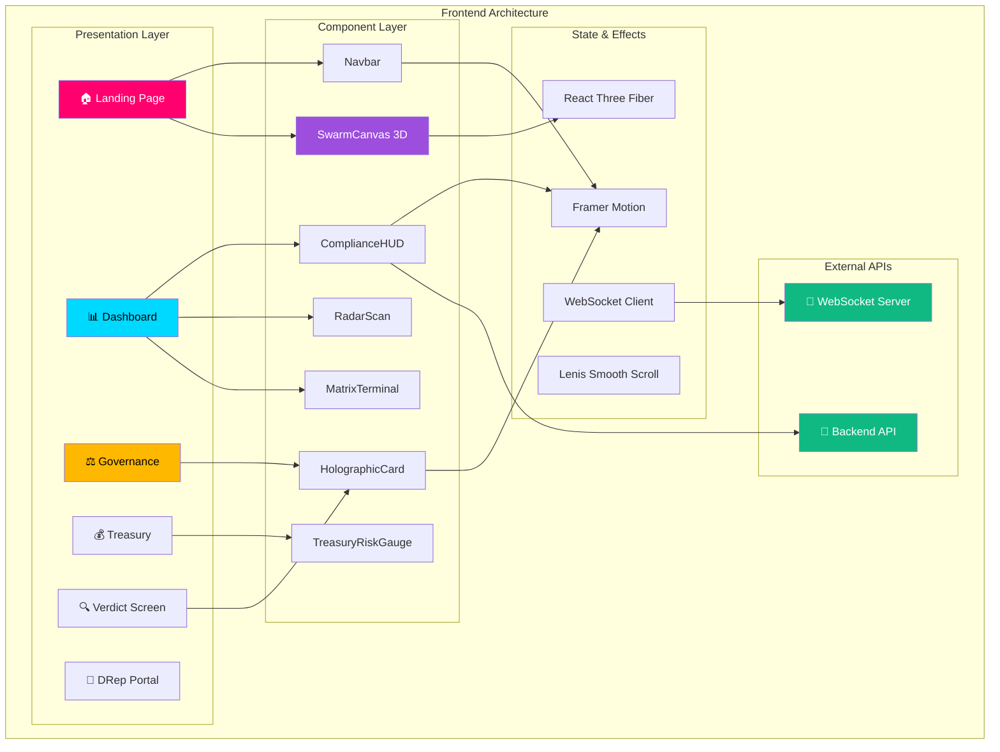

<div align="center">

# 🖥️ SON Frontend


**Immersive Cyberpunk Dashboard for Cardano Governance & Security**

[Live Demo](#) • [Screenshots](#-screenshots) • [Quick Start](#-quick-start) • [Architecture](#-architecture)

</div>

---

## 🎯 Overview

The SON Frontend is a **cutting-edge, immersive cyberpunk interface** designed for Cardano DReps and security-conscious users. Built with Next.js 16 and React 19, it features:

- 🌌 **3D Agent Swarm Visualization** — Real-time WebGL particles
- ⚡ **Sub-second Governance Analysis** — Live proposal insights
- 🎨 **Holographic UI Components** — Glassmorphism + neon aesthetics
- 🔄 **Real-time WebSocket Updates** — Live agent activity streams
- 📱 **Responsive Design** — Works on desktop, tablet, and mobile

---

## 📸 Screenshots

<div align="center">

| Landing Page | Dashboard | Governance Analysis |
|:------------:|:---------:|:-------------------:|
|  |  |  |

</div>

---

## 🏗️ Architecture



---

## 📁 Project Structure

```
frontend/
├── 📂 app/                          # Next.js App Router
│   ├── 📄 layout.tsx                # Root layout with fonts & providers
│   ├── 📄 page.tsx                  # Landing page (Hero + Features)
│   ├── 📄 globals.css               # Global styles + Tailwind
│   │
│   ├── 📂 about/                    # About/Protocol Architecture
│   ├── 📂 dashboard/                # Main Security Dashboard
│   ├── 📂 drep/                     # DRep Portal & Settings
│   ├── 📂 governance/               # Governance Proposal Analysis
│   ├── 📂 treasury/                 # Treasury Risk Monitoring
│   └── 📂 verdict/                  # Scan Verdict Display
│
├── 📂 components/                   # Reusable UI Components
│   ├── 📂 ui/                       # Atomic UI primitives
│   │   └── 📄 Button.tsx            # Custom button variants
│   │
│   ├── 📄 AgentEconomy.tsx          # Agent marketplace viz
│   ├── 📄 ComplianceHUD.tsx         # Real-time compliance panel
│   ├── 📄 CustomCursor.tsx          # Custom cursor effect
│   ├── 📄 DRepConsensus.tsx         # DRep voting visualization
│   ├── 📄 HolographicCard.tsx       # Glassmorphic cards
│   ├── 📄 HyperspaceTransition.tsx  # Page transition effect
│   ├── 📄 MatrixTerminal.tsx        # Matrix-style terminal
│   ├── 📄 Navbar.tsx                # Navigation bar
│   ├── 📄 PageTransition.tsx        # Route animations
│   ├── 📄 RadarScan.tsx             # Radar visualization
│   ├── 📄 ScrambleText.tsx          # Text scramble effect
│   ├── 📄 SmoothScroll.tsx          # Lenis scroll wrapper
│   ├── 📄 SwarmCanvas.tsx           # 3D particle swarm
│   ├── 📄 ThreatProofCard.tsx       # Cryptographic proof display
│   ├── 📄 TreasuryRiskGauge.tsx     # Treasury risk dial
│   └── 📄 VerdictScreen.tsx         # Final verdict display
│
├── 📂 public/                       # Static assets
│   ├── 🖼️ hero-bg.png              # Hero background
│   ├── 🖼️ noise.png                # Noise overlay texture
│   └── 🖼️ protocol-circuit.png     # Circuit pattern
│
├── 📄 next.config.ts                # Next.js configuration
├── 📄 tailwind.config.ts            # Tailwind + custom theme
├── 📄 tsconfig.json                 # TypeScript config
└── 📄 package.json                  # Dependencies
```

---

## 🎨 Design System

### Color Palette

| Color              | Hex       | Usage                          |
|--------------------|-----------|--------------------------------|
| 🟣 Neon Orchid     | `#FF006E` | Primary actions, highlights    |
| 🔵 Electric Cyan   | `#00D9FF` | Secondary, links               |
| 🟡 Amber Warning   | `#FFB800` | Warnings, alerts               |
| 🟢 Verdict Green   | `#10B981` | Success states                 |
| ⚫ Obsidian Core   | `#0D0D0D` | Background                     |
| ⚪ Ghost White     | `#F8F8FF` | Primary text                   |
| 🟣 Plasma Pink     | `#FF69B4` | Gradient accents               |

### Typography

| Font           | Usage                    | Variable              |
|----------------|--------------------------|----------------------|
| **Orbitron**   | Headlines, titles        | `--font-orbitron`    |
| **Space Grotesk** | Body text             | `--font-space-grotesk` |
| **JetBrains Mono** | Code, monospace      | `--font-jetbrains-mono` |

---

## 🚀 Quick Start

### Prerequisites

- **Node.js** 18.0+ 
- **npm** 9.0+ or **yarn** 1.22+
- **Backend API** running on `http://localhost:8000`

### Installation

```bash
# 1. Navigate to frontend directory
cd frontend

# 2. Install dependencies
npm install

# 3. Start development server
npm run dev

# 4. Open browser
open http://localhost:3000
```

### Environment Variables

Create a `.env.local` file:

```env
# Backend API URL
NEXT_PUBLIC_API_URL=http://localhost:8000

# WebSocket URL
NEXT_PUBLIC_WS_URL=ws://localhost:8000

# Optional: Analytics
NEXT_PUBLIC_GA_ID=UA-XXXXXXXXX-X
```

---

## 📜 Available Scripts

| Command           | Description                              |
|-------------------|------------------------------------------|
| `npm run dev`     | Start development server (hot reload)   |
| `npm run build`   | Create production build                 |
| `npm run start`   | Start production server                 |
| `npm run lint`    | Run ESLint                              |

---

## 🧩 Key Components

### SwarmCanvas

3D WebGL particle system representing the agent swarm:

```tsx
import { SwarmCanvas } from "@/components/SwarmCanvas";

<SwarmCanvas />
```

- Uses **React Three Fiber** + **Three.js**
- 1000+ animated particles
- GPU-accelerated rendering
- Responds to scroll position

### HolographicCard

Glassmorphic card with hover effects:

```tsx
import { HolographicCard } from "@/components/HolographicCard";

<HolographicCard className="p-8">
  <h3>Agent Status</h3>
  <p>All systems operational</p>
</HolographicCard>
```

### RadarScan

Animated radar visualization for real-time monitoring:

```tsx
import { RadarScan } from "@/components/RadarScan";

<RadarScan 
  threats={3}
  scanRadius={100}
/>
```

---

## 🔌 API Integration

### REST Endpoints

```typescript
// Scan a transaction
POST /api/v1/scan
Body: { policy_id: string, user_tip: number }

// Get governance proposals
GET /api/v1/governance

// Analyze proposal
POST /api/v1/governance/proposal-check
Body: { ipfs_hash: string }

// Treasury risk
GET /api/v1/treasury/risk/current
```

### WebSocket Connections

```typescript
// Real-time scan updates
ws://localhost:8000/ws/scan/{task_id}

// Agent activity logs
ws://localhost:8000/ws/logs
```

---

## ⚡ Performance Optimizations

| Optimization               | Implementation                          |
|----------------------------|-----------------------------------------|
| **Code Splitting**         | Next.js automatic route splitting       |
| **Image Optimization**     | Next.js `<Image>` with WebP             |
| **Font Optimization**      | `next/font` with font subsetting        |
| **3D Rendering**           | React Three Fiber with instancing       |
| **Smooth Scrolling**       | Lenis with RAF optimization             |
| **Animation**              | Framer Motion with `layout` prop        |

---

## 🎭 Animation System

Built with **Framer Motion** for declarative animations:

```tsx
// Page transitions
<motion.div
  initial={{ opacity: 0, y: 20 }}
  animate={{ opacity: 1, y: 0 }}
  exit={{ opacity: 0, y: -20 }}
  transition={{ duration: 0.5, ease: "easeOut" }}
>
  {children}
</motion.div>

// Scroll-linked animations
const { scrollYProgress } = useScroll();
const y = useTransform(scrollYProgress, [0, 1], ["0%", "50%"]);
```

---

## 📱 Responsive Breakpoints

| Breakpoint | Width    | Target Device       |
|------------|----------|---------------------|
| `sm`       | 640px    | Mobile landscape    |
| `md`       | 768px    | Tablets             |
| `lg`       | 1024px   | Laptops             |
| `xl`       | 1280px   | Desktops            |
| `2xl`      | 1536px   | Large monitors      |

---

## 🔧 Configuration Files

### `next.config.ts`

```typescript
const nextConfig = {
  reactStrictMode: true,
  images: {
    domains: ['ipfs.io', 'gateway.pinata.cloud'],
  },
  experimental: {
    optimizePackageImports: ['lucide-react', 'framer-motion'],
  },
};
```

### `tailwind.config.ts`

```typescript
module.exports = {
  theme: {
    extend: {
      colors: {
        'obsidian-core': '#0D0D0D',
        'ghost-white': '#F8F8FF',
        'neon-orchid': '#FF006E',
        'electric-cyan': '#00D9FF',
        'amber-warning': '#FFB800',
        'plasma-pink': '#FF69B4',
      },
      fontFamily: {
        orbitron: ['var(--font-orbitron)'],
        'space-grotesk': ['var(--font-space-grotesk)'],
        mono: ['var(--font-jetbrains-mono)'],
      },
    },
  },
};
```

---

## 📦 Dependencies

### Core

| Package              | Version  | Purpose                        |
|----------------------|----------|--------------------------------|
| `next`               | 16.0.3   | React framework                |
| `react`              | 19.2.0   | UI library                     |
| `react-dom`          | 19.2.0   | DOM rendering                  |
| `typescript`         | ^5.0     | Type safety                    |

### Styling & Animation

| Package              | Version  | Purpose                        |
|----------------------|----------|--------------------------------|
| `tailwindcss`        | ^4.0     | Utility-first CSS              |
| `framer-motion`      | ^12.23   | Animations                     |
| `clsx`               | ^2.1     | Conditional classes            |
| `tailwind-merge`     | ^3.4     | Merge Tailwind classes         |

### 3D & Visualization

| Package              | Version  | Purpose                        |
|----------------------|----------|--------------------------------|
| `three`              | ^0.181   | 3D graphics                    |
| `@react-three/fiber` | ^9.4     | React Three.js renderer        |
| `@react-three/drei`  | ^10.7    | Three.js helpers               |
| `maath`              | ^0.10    | Math utilities                 |

### UI Components

| Package              | Version  | Purpose                        |
|----------------------|----------|--------------------------------|
| `lucide-react`       | ^0.555   | Icon library                   |
| `lenis`              | ^1.3     | Smooth scrolling               |

---

## 🤝 Contributing

1. Fork the repository
2. Create a feature branch: `git checkout -b feature/amazing-feature`
3. Commit changes: `git commit -m 'Add amazing feature'`
4. Push to branch: `git push origin feature/amazing-feature`
5. Open a Pull Request

### Code Style

- Use **TypeScript** for all components
- Follow **ESLint** configuration
- Use **Prettier** for formatting
- Write **meaningful commit messages**

---

## 📄 License

This project is licensed under the **MIT License** — see the [LICENSE](../LICENSE) file for details.

---

<div align="center">

**Built with 💜 for the Cardano Community**

[⬆️ Back to Top](#-son-frontend)

</div>
